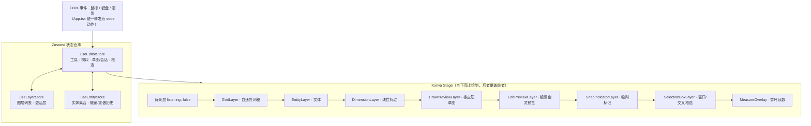

# Web CAD App

<div align="center">


**纯前端浏览器 CAD 应用** —— 视口交互 · 多图层 · 工程制图标注 · DXF 互操作

</div>

## ✨ 核心特性

- **高性能 Canvas 渲染**：Konva + React 19，九层渲染管线分离静态图元与交互预览；恒定像素线宽与恒定字号，任意缩放比例下观感一致
- **多图层体系**：图层创建/激活/显隐/锁定/删除，颜色继承（实体可显式覆盖），默认 `0` 层受保护
- **完整建模实体**：直线、矩形、圆、多段线（旋转/斜镜像自动转换）、线性标注，50 步撤销/重做
- **智能对象捕捉（OSNAP）**：端点/中点/圆心/象限点/最近点/交点，屏幕阈值内自动吸附，F3 开关
- **工程标注与测量**：三连点线性标注（尺寸界线 + 箭头尺寸线 + 居中两位小数文本）；临时卷尺测量
- **经典编辑命令栈**：移动 / 复制（Shift 正交锁定）、旋转、修剪（点击侧求交裁剪）、镜像（两点定轴、可选保留原件）、偏移（平行线/同心圆/缩放矩形）
- **窗口 / 交叉框选**：左→右实线蓝框完全包含、右→左虚线绿框接触即选；多选批量移动 / 换图层 / 改色 / 删除
- **正交与精确输入**：ORTHO 正交模式（F8，Shift 临时反转）；绘图草图中键入数字 + Enter 定长/定半径
- **文件互操作**：`.cad.json` 工程持久化（新建/打开/保存）；DXF 导入导出（图层表 + 真彩色，Y 轴自动翻转）
- **生产级部署**：多阶段 Docker 构建（node:20-alpine → nginx:alpine-slim），Gzip + 不可变静态缓存 + SPA 回退

## 🏗 多层 Canvas 架构



- **视口变换**：所有实体与预览图层内套 `<Group x={offsetX} y={offsetY} scale={scale}>` 完成世界坐标 → 屏幕坐标映射；`strokeScaleEnabled={false}` 与 `px / scale` 保证线宽、字号恒定像素
- **单一数据源**：三个 zustand 仓库严格分工——编辑器仓库管交互会话，图层仓库管图层表，实体仓库管图元与历史；标注纳入实体联合类型，天然复用图层 / 撤销 / 删除机制
- **渲染与落盘分离**：预览图层全程只读，落盘动作在确认回调中一次性提交

## 🧰 工具一览

| 工具 | 说明 |
|---|---|
| 选择 | 点选 / Shift 增选减选 / 整组拖拽 / 窗口框选 / 交叉框选 |
| 平移 | 抓手拖拽；任意工具下可中键拖拽平移 |
| 直线 / 矩形 / 圆 | 两点式 / 两对角点 / 圆心 + 半径，支持吸附与正交 |
| 线性标注 | 三连点：测量起点 → 测量终点 → 尺寸线偏移位置 |
| 距离测量 | 两连点临时卷尺（距离 / ΔX / ΔY），不落盘 |
| 移动 / 复制 | 点实体（即基准点）→ 点目标点，Shift 锁定水平垂直 |
| 旋转 | 点实体 → 点旋转基准 → 点角度点（以实体中心为参考方向） |
| 修剪 | 点线段多余线头一侧，自动求交裁剪 |
| 镜像 | 点实体 → 两点定轴，工具栏可切换保留原件 |
| 偏移 | 工具栏设距离 → 点实体一侧（直线→平行线、圆→同心圆、矩形→缩放矩形） |

## ⌨️ 快捷键映射

### 全局

| 快捷键 | 功能 |
|---|---|
| `Ctrl+Z` / `Ctrl+Y` / `Ctrl+Shift+Z` | 撤销 / 重做（50 步） |
| `Ctrl+S` | 保存工程为 `.cad.json`（拦截浏览器原生行为） |
| `Ctrl+O` | 打开工程文件 |
| `Esc` | 逐级取消：命令输入 → 编辑会话 → 卷尺 → 草图 → 框选 → 取消选择并回到选择工具 |
| `Delete` / `Backspace` | 批量删除选中实体（锁定图层自动跳过） |
| `F3` | 对象捕捉（OSNAP）开关 |
| `F8` | 正交模式（ORTHO）开关 |
| `Shift`（按住） | 临时反转正交状态；选择工具下为增选/减选 |
| `Space` | 重复上一绘图/编辑命令 |
| `0-9` `.` | 画线/画圆草图中键入精确长度/半径（Enter 确认，Esc 放弃） |

> 所有快捷键均受输入焦点守卫保护：输入框聚焦时仅响应 Esc 与 Ctrl+S/O，避免误触发画布操作。

### 鼠标

| 操作 | 功能 |
|---|---|
| 滚轮 | 以光标为锚点缩放（0.01× ~ 1000×） |
| 中键拖拽 | 任意工具下平移画布 |
| 左键拖拽空白（选择工具） | 左→右窗口框选（实线蓝框，完全包含）/ 右→左交叉框选（虚线绿框，接触即选） |
| 左键拖拽实体 | 移动（多选时整组移动，一步撤销历史） |

## 📁 文件格式

| 格式 | 方向 | 说明 |
|---|---|---|
| `.cad.json` | 导入 / 导出 | 完整工程持久化（图层 + 实体），带校验清洗 |
| DXF | 导入 / 导出 | 直线→LINE、矩形→封闭 POLYLINE、圆→CIRCLE；图层表含真彩色；Y 轴自动翻转；导入时轴对齐封闭 4 点多段线还原为矩形，不支持的实体安全跳过 |

## 🚀 本地开发

```bash
# 安装依赖（锁定 package-lock.json）
npm install

# 启动开发服务器（HMR）
npm run dev
# → http://localhost:5173

# 生产构建（tsc -b 类型检查 + vite build，零警告零错误）
npm run build
# → dist/

# 本地预览构建产物
npm run preview

# 代码检查
npm run lint
```

## 🐳 Docker 部署

```bash
# 一键构建并启动（多阶段构建：node:20-alpine 编译 → nginx:alpine-slim 托管）
docker compose up -d --build

# → http://localhost:8080
```

Nginx 生产配置要点（`nginx.conf`）：

- **Gzip 压缩**：js / css / json / svg 文本资源
- **不可变缓存**：Vite 带内容 hash 的 `/assets/` 静态资源缓存一年（`immutable`）
- **入口无缓存**：`index.html` 强制 `no-cache`，发版即时生效
- **SPA 回退**：`try_files $uri $uri/ /index.html`
- **大文件支持**：`client_max_body_size 100m`，便于导入大型 DXF 图纸

## 📂 项目结构

```
web-cad-app/
├── src/
│   ├── components/
│   │   ├── canvas/          # 九层渲染管线（实体/标注/预览/吸附/框选/卷尺…）
│   │   └── layout/          # 顶栏/工具栏/图层面板/状态栏/命令输入框
│   ├── core/
│   │   ├── io/              # DXF 与工程文件导入导出
│   │   ├── math/            # 坐标变换/几何求交/吸附引擎/实体变换
│   │   └── state/           # zustand 三仓库（editor / entity / layer）
│   ├── types/               # 实体与标注类型定义
│   ├── App.tsx              # 事件分发中枢（DOM 事件 → store 动作）
│   └── main.tsx
├── Dockerfile               # 多阶段生产镜像
├── nginx.conf               # 生产站点配置
├── docker-compose.yml       # 8080:80
└── vite.config.ts
```
